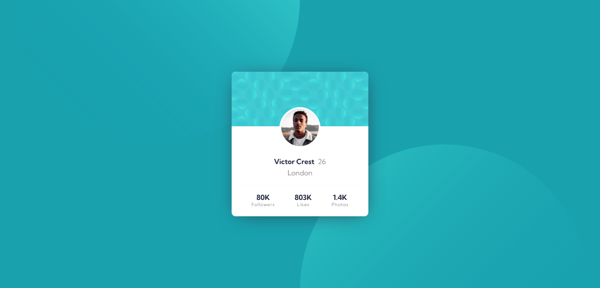

# Frontend Mentor - Profile card component solution

This is a solution to the [Profile card component challenge on Frontend Mentor](https://www.frontendmentor.io/challenges/profile-card-component-cfArpWshJ). Frontend Mentor challenges help you improve your coding skills by building realistic projects. 

## Table of contents

- [Overview](#overview)
  - [The challenge](#the-challenge)
  - [Screenshot](#screenshot)
  - [Links](#links)
  - [Built with](#built-with)
  - [What I learned](#what-i-learned)
  - [Continued development](#continued-development)
  - [Useful resources](#useful-resources)
- [Author](#author)
- [Acknowledgments](#acknowledgments)

## Overview

### The challenge

- Build out the project to the designs provided

### Screenshot




### Links

- Solution URL: [Code Solution](https://github.com/slickLink/profile-card-component-main)
- Live Site URL: [Live site](https://profile-card-component-main-solution.netlify.app/)

### Built with

- Semantic HTML5 markup
- SCSS/SASS
- Flexbox

### What I learned

I learned a lot about working with backgrounds using css,
1) you can have more than one img in a background.
2) background positioning cannot be offset from center keyword.  Ahmed Faisal helped a lot with this with magic of calc.


```css
body {
    background: url(./images/bg-pattern-top.svg) calc(50vw - 100vh) -50vh  no-repeat, 
    50vw 50vh no-repeat url(./images/bg-pattern-bottom.svg) $dark_cyan;
    background-size: auto 100%;
}
```

### Continued development
- so much css to learn lmao.

### Useful resources

- [Background positioning](https://developer.mozilla.org/en-US/docs/Web/CSS/background-position) - MDN is awesome
- [Kevin Powell](https://www.youtube.com/watch?v=3T_Jy1CqH9k) - Helped in understanding the MDN docs on backgrounds.

## Author

- Frontend Mentor - [@slickLink](https://www.frontendmentor.io/profile/slickLink)

## Acknowledgments

- [Ahmed Faisal](https://github.com/afrussel/)
- [Kevin Powell](https://www.youtube.com/channel/UCJZv4d5rbIKd4QHMPkcABCw)
